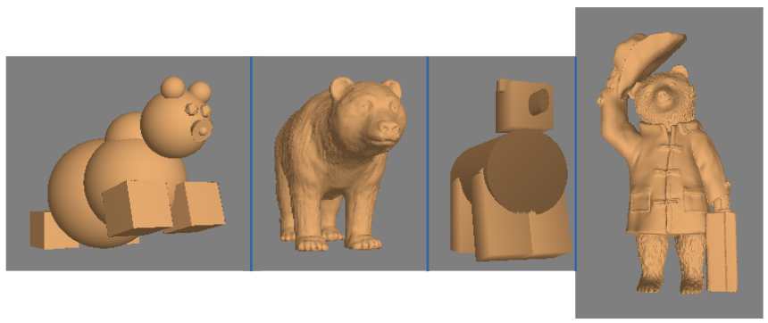

# [EN] Angry Bears

This is a 3D game made with Python 2.7 during the course “Modelation and Graphic Computation”.
Graphics are made with OpenGL.
It follows the Model View Controller methodology, though the logic remains in the same file.

The base idea is the popular game Angry Birds, where birds are thrown in order to destroy some structures of pigs.
Here, Mr. Peter has to feed his hungry bears wich are located accross the river, really starving, throwing them different
food with a sling.

A physical environment based on spherical coordinates was implemented, starting from the slingshot. This environment uses the trajectory equation to update the position of the food items at each time instant t and to detect their possible collision with the bears.

  

Trajectory Equation:

$$x(t) = x_0 + v_0 t + \frac{1}{2} a t^2$$

Coordinates used (food is located at the position marked with X):

  

A more updated version for Python 3.x will be available at some point.

## Before running the game

Before you can use the game, you must have installed the requirement packages listed on ‘requirements.txt’.
You can install them with pip, by the command `pip install -r requirements.txt`.

## Running the game

To run the game, you need to execute the ‘main.py’ file.
This can be done by the command `python main.py`.

### Controls

- A: Increase shoot power
- Z: Decrease shoot power
- Space: Shoot food in sling
- Q: Quit the game

## Model visualizer

In order to visualize beforehand how and what items are present in the game, you can run the ‘Modelos_Visualizacion.py’
script.
This can be done with the command `python Modelos_Visualizacion.py`.

### Controls

- Up: Make the object to spin upwards
- Down: Make the object to spin downwards
- Right: Chantge to next object
- Left: Change to previous object
- Q: Quit the visualizer

### Models

Three main classes of models were created: Food, Bear, and Slingshot.

#### Alimento (Food)

Six different food items were worked with:

1. Steak: This was imported from two STL files uploaded by the user MakerBot: "meat.stl" for the meat part and "fat.stl" for the fat.
2. Chocolate: This was implemented from an STL file named "chocoplate.stl," uploaded by the user Tosh.
3. Peanut: This was imported from the STL file named "peanut 2.stl" by the user WilliamAAdams.
4. Orange: This was drawn using two GLUT spheres—a larger one for the main body and a smaller one for the bottom—along with a "hand-drawn" cylinder at the top to represent the stem.
5. Pear: This was drawn using one GLUT sphere for the main body and another deformed along the Y-axis to represent the part closest to the stem, which was represented by two cylinders, one vertical and one tilted.
6. Fish: This was implemented from an STL file named "concrete fish.stl," uploaded by the user pmoews.

  

#### Oso (Bear)

The four bears were drawn using different methods:

1. OsoGLUT (GLUTBear): This bear was drawn using GLUT figures. It was developed with one cube for each paw; seven spheres (one for the head, one for the torso, one for the back of the torso, one for the hip, two for the ears, and one for the nose); two icosahedrons, one for each eye; and a cone for the snout.
2. OsoImportado (ImportedBear): This bear was drawn from a binary STL file named "Bear t.stl," uploaded by the user Yahho Japan.
3. OsoMano (HandDrawnBear): This bear was drawn by manually specifying points. For this, the points and normals of cubes and cylinders, with a width of 1 and centered at the origin, were specified to allow for easier displacement and scaling. Thus, eight cubes were used—one for the head, two for the ears, one for the snout, and four for the paws—and one cylinder was used for the bear's body.
4. OsoPaddington (PaddingtonBear): The fourth bear was to be drawn using one of the aforementioned methods, or a mixture thereof. It was chosen to be imported from an STL file, and Paddington Bear was selected. It was imported from text-based STL files uploaded by the user Mag-net: "Paddington Bear.stl," which contained the body, and "Paddington Bear Suitcase.stl," which contained the left hand along with the suitcase.

  

#### Honda (Slingshot)

The slingshot was made from three cylinders of the same color, arranged in a Y-shape. Its main method was getPos, which returned the position to place food items to be launched from there.

  

# [ES] Angry Bears

Este es un juego en 3D realizado en Python 2.7 durante el curso «Modelación y computación gráfica».
Los gráficos están realizados con OpenGL.
Sigue la metodología Modelo Vista Controlador, aunque toda la lógica en un mismo archivo.

La idea base es el popular juego Angry Birds, donde se lanzan pájaros para destruir ciertas estructuras de los cerdos.
Aquí, Don Pedro debe alimentar a sus osos hambrientos que se encuentran al otro lado del río, muertos de hambre, lanzándoles
diferentes alimentos mediante una honda.

Se implementó un ambiente físico basado en coordenadas esféricas desde la honda, utilizando la ecuación de itinerario para actualizar en cada instante de tiempo $t$ la posición de los alimentos y detectar su posible colisión con los osos.

  

Ecuación de itinerario:

$$x(t) = x_0 + v_0 t + \frac{1}{2} a t^2$$

Coordinates utilizadas (la comida se ubica en la posición marcada con X):

  

En algún momento se tendrá una versión más actualizada para Python 3.x.

## Antes de utilizar el juego

Antes de que usted pueda usar el juego, debe contar con los paquetes mencionados en el archivo ‘Requirements.txt’.
Se pueden instalar mediante la herramienta pip, con el comando `pip install -r requirements.txt`.

## Ejecutar el juego

Para ejectar el juego, se debe ejectar el archivo ‘main.py’.
Esto se puede hacer mediante el comando `python main.py`.

### Controles

- A: Aumentar la potencia de disparo
- Z: Disminuir la potencia de disparo
- Espacio: Lanzar el alimento de la honda
- Q: Salir del juego

## Visualizador de modelos

Para visualizar de antemano cómo son y qué objetos hay presentes en el juego, se puede ejecutar el *script* ‘Modelos_Visualizacion.py’.
Esto puede realizarse con el comando `python Modelos_Visualizacion.py`

### Controles

- Arriba: Hacer que el objeto gire hacia arriba
- Abajo: Hacer que el objeto gire hacia abajo
- Derecha: Cambiar al objeto siguiente
- Left: Cambiar al objeto anterior
- Q: Salir del visualizador

### Modelos

Se crearon tres clases principales de modelos: Alimento, Oso y Honda.

#### Alimento

Se trabajó con 6 alimentos diferentes.

1. Bistec. Se importó desde dos archivos en STL subidos por el usuario MakerBot, de nombre «meat.stl» para la parte de la carne, y de nombre «fat.stl» para la
grasa.
2. Chocolate. Se implementó desde un fichero STL de nombre «chocoplate.stl», subido por el usuario Tosh.
3. Mani. Se importó desde el archivo STL de nombre «peanut 2.stl» del usuario WilliamAAdams.
4. Naranja. Se dibujó a partir de 2 esferas GLUT, una más grande para el pomo y otra más pequeña para la parte inferior, además de un cilindro dibujado «a mano» en la parte superior para representar el rabillo1.
5. Pera. Se dibujó a partir de una esfera GLUT para el pomo y otra deformada hacia el eje Y para representar la parte más cercana al rabillo, que se representó por medio de dos cilindros, uno vertical y otro ladeado.
6. Pescado. Se implementó desde un archivo STL de nombre «concrete fish.stl», subido por el usuario pmoews.

  

#### Oso

Los 4 osos fueron dibujados mediante métodos distintos.
1. OsoGLUT. Oso dibujado mediante figuras de GLUT. Fue desarrollado con un cubo para cada pata; 7 esferas, una para la cabeza, otra para el tronco, otra para la parte posterior del tronco, otra para la cadera, dos para las orejas y una para la nariz; 2 icosaedros, uno para cada ojo; y un cono para el hocico.
2. OsoImportado. Oso dibujado a partir de un fichero STL en binario, llamado «Bear t.stl», subido por el usuario Yahho Japan.
3. OsoMano. Este oso fue dibujado especificando los puntos a mano. Para ello, se especificaron los puntos y las normales de cubos y cilindros, de ancho 1 y centrados en el origen, de tal manera de poder desplazarlos y escalarlos de una manera no tan difícil. Así, se ocuparon 8 cubos, uno para la cabeza, otros dos para las orejas, otro para el hocico, y cuatro más para las patas; y se ocupó un cilindro para hacer el cuerpo del oso.
4. OsoPaddington. El cuarto oso debıía ser dibujado mediante alguno de los métodos mencionados anteriormente, o bien realizando una mezcla. De esta forma, se escogió importarlo de un archivo STL, y se seleccionó al oso Paddington. Así, se importó desde los archivos STL de texto subidos por el usuario Mag-net, «Paddington Bear.stl», que contenía el cuerpo, y «Paddington Bear Suitcase.stl», que contenía la mano izquierda junto con la maleta.

  

#### Honda

La honda fue hecha a partir de tres cilindros del mismo color, que se pusieron en forma de Y. Su método principal consistió en `getPos`, un método que retornaba la posición donde ubicar los alimentos para ser lanzados desde allí.

  

